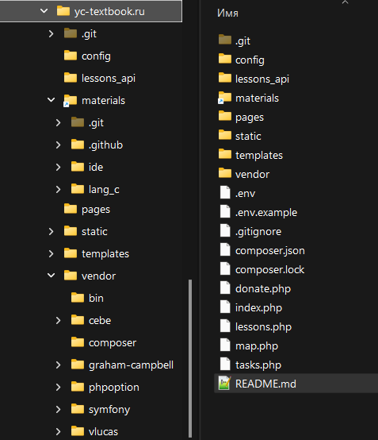

## Сервер для локального запуска учебников

Требования: 
-- apache сервер с php не ниже 7.4
-- composer


### Порядок развёртывания

1. Создать локальный сайт, например, yc-textbook.ru 
2. В корень папки с сайтом склонировать содержимое репозитория
```bash
cd pasth/to/your/local/site/folder

git clone git@github.com:YoungCoder-Ru/textbook_homeserver.git .
```
3. Создать в папке с сайтом директорию materials и склонировать туда содержимое репозитория https://github.com/YoungCoder-Ru/youngcoder.ru
4. У файла `.env.example` удалить `.example`.
5. Открыть файл .env для редактирования и в параметре SITE_URL указать название вашего локального сайта. Сейчас там `http://yc-textbook.ru`

6. Выполнить команду `composer install

После выполнения этих шагов у вас должна быть примерно следующая структура файлов и папков:



7. Запустить сервер и открыть локальный сайт в браузере. 

Если всё сделано верно, то появится локальная копия сайта без лишних разделов
